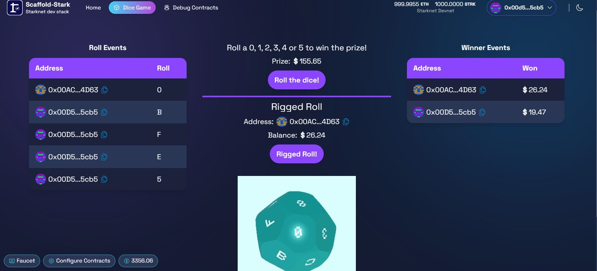

# 🎲 Dice Roll on Chain

On-Chain Provably Fair Dice Game. Won $3000 at uOttaHack7!

Built on **Starknet**

## About

A blockchain-powered dice roll game leveraging Starknet's Layer 2 technology for fast, secure, and transparent gameplay. Smart contracts written in Cairo ensure provably fair randomness for every dice roll, with all game logic executed on-chain.

## Getting Started

1. Install Rust: **https://www.rust-lang.org/tools/install**
2. Install Scarb, Starkli, and Starknet Foundry: **https://docs.starknet.io/quick-start/environment-setup/**
3. Install Starknet Devnet: **https://0xspaceshard.github.io/starknet-devnet-rs/**
4. Run Starknet Devnet: `starknet-devnet --seed 0`
5. Fetch your account:
   * `starkli signer keystore from-key account0_keystore.json`
      * Use `0x0000000000000000000000000000000071d7bb07b9a64f6f78ac4c816aff4da9` (Starknet default test account) as the private key
      * No need to enter a password (just hit enter)
   * `starkli account fetch 0x064b48806902a367c8598f4f95c305e8c1a1acba5f082d294a43793113115691 --rpc http://127.0.0.1:5050 --output account0_account.json`
6. Build contracts:
   * `cd ./cairo`
   * `scarb build`
7. Deploy contracts:
   * `starkli declare target/dev/YOUR_CONTRACT_NAME.contract_class.json --rpc http://127.0.0.1:5050 --account ../account0_account.json --keystore ../account0_keystore.json`
   * Take note of the outputted class hash and replace CLASS_HASH with it in the next step
   * `starkli deploy CLASS_HASH --rpc http://127.0.0.1:5050 --account ../account0_account.json --keystore ../account0_keystore.json`
8. Enter CONTRACT_ADDRESS into your frontend configuration file
9. Install packages:
   * `cd` into `frontend/`
   * `npm install` or `pnpm i`
10. Start app: `npm run dev` or `pnpm dev`
11. Head to the displayed url and play! ex. **http://localhost:5173/**

## Team

- Muhaimin Ali - Developer
- Connor Liu - Developer
